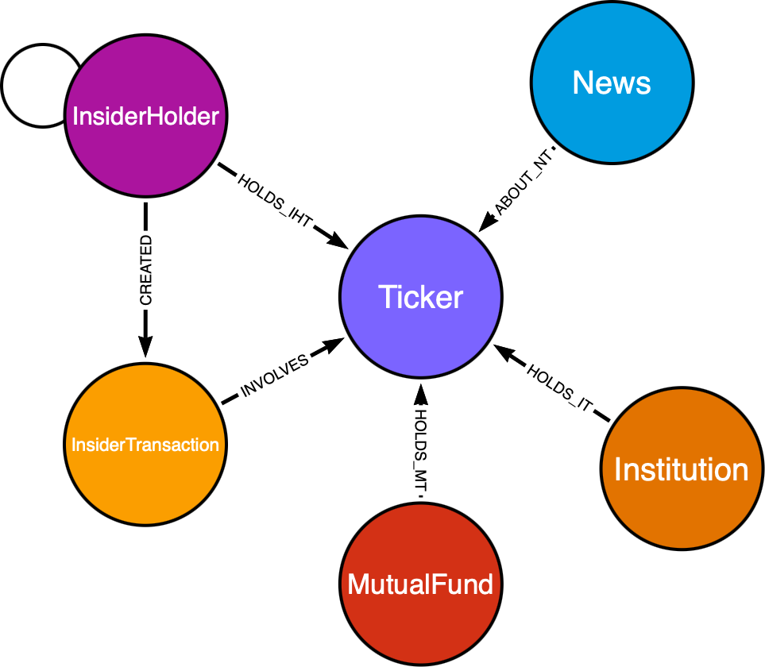

# Financial Knowledge Graph

## Overview
This project aims to create a comprehensive Financial Knowledge Graph. Currently, the Knowledge Graph contains information about companies, their stock prices, and financial metrics from Yahoo Finance, using the yfinance library. The data is translated into a graph database schema and stored in Memgraph.
The Knowledge Graph provides a structured representation of financial data, allowing for efficient querying and analysis.

Once the Docker container is running, the Knowledge Graph can be queried using the Memgraph Lab interface. The Lab provides a user-friendly environment for exploring the graph database and running queries.

The database will be fetched once the container is running and will be be updated every working day after the market closes.
To modify the list of companies, edit the .env file in the root directory and to modify the update frequency, edit the [Dockerfile](src/Dockerfile) cron job.

The data is being stored in data/ directory in the root directory of the project. The data is stored in CSV format and can be used for further analysis or visualization. Only the most recent data is stored in the memgraph database.

## Features
- Fetches financial data from Yahoo Finance using the yfinance library.
- Translates the fetched data into a graph database schema.
- Stores the data in Memgraph, a high-performance graph database.
- Provides query capabilities to explore and analyze the financial data.
- Can be easily deployed using Docker.

## Prerequisites
- Docker
- Docker Compose

## Installation
1. Clone the repository: `git clone https://github.com/ondrabimka/FINANCIAL_KG`
2. Change into the project directory: `cd FINANCIAL_KG`
3. Create a `.env` file in the root directory with the following content (or copy the `.env.example` file and rename it to `.env`):
```
COMPANIES=GOOGL,AAPL,MSFT

QUICK_CONNECT_MG_HOST=memgraph # docker deployment
QUICK_CONNECT_MG_PORT=7687     # docker deployment
```
4. Run docker-compose: `docker-compose up -d`

## Usage
Data is fetched automatically from Yahoo Finance and translated into a graph database schema. The Knowledge Graph can be queried using the Memgraph Lab interface.
1. Lab is available at `http://localhost:3000`


## Dabase schema
Database schema is defined in [Models](src/db/models.py)



## TODO
- Add news data
- Explore Yfinance data in more detail

## Contributing
Contributions are welcome! Please follow the code style and structure of the project (to some extent).
